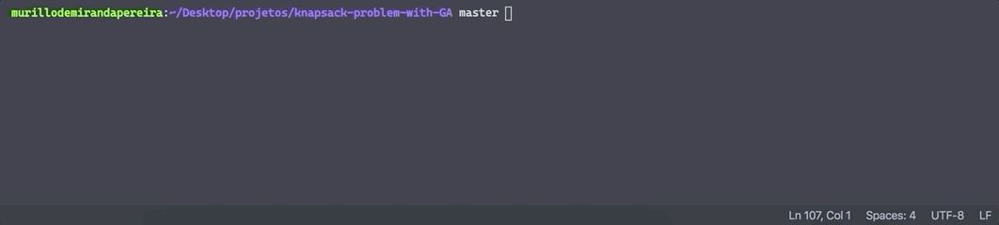

# knapsack-problem-with-GA

Solving knapsack problem using genetic algorithm (GAs).

## Inputs

### Initial population

A1 -> {1,0,0,1,1,0}

A2 -> {0,0,1,1,1,0}

A3 -> {0,1,0,1,0,0}

A4 -> {0,1,1,0,0,1}

### Max weight

30kg

### Items

| Item         | weight | score |
| ------------ | ------ | ----- |
| Sleeping bag | 15     | 15    |
| Rope         | 3      | 7     |
| Switchblade  | 2      | 10    |
| Torch        | 5      | 5     |
| Bottle       | 9      | 8     |
| Food         | 20     | 17    |

## Usage

Run in terminal:

> python3 knapsack.py

## Example

## License

Distributed under the MIT license. See [LICENSE](./LICENSE.md) for details.
